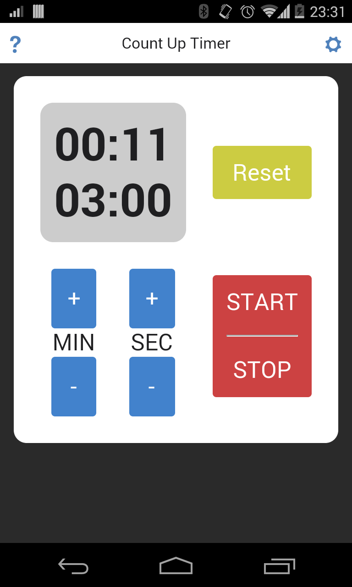
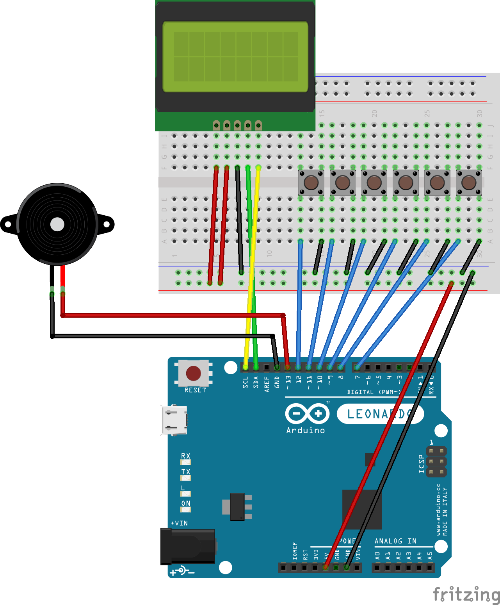
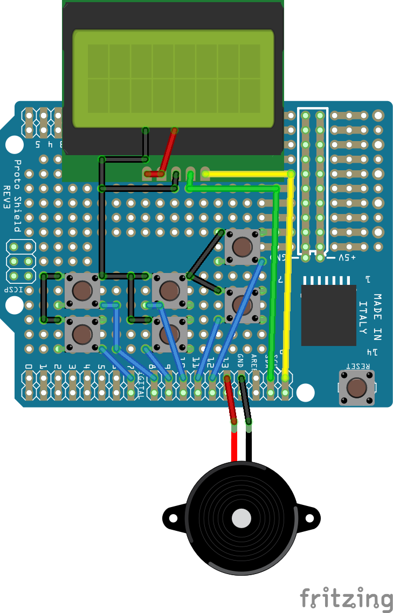
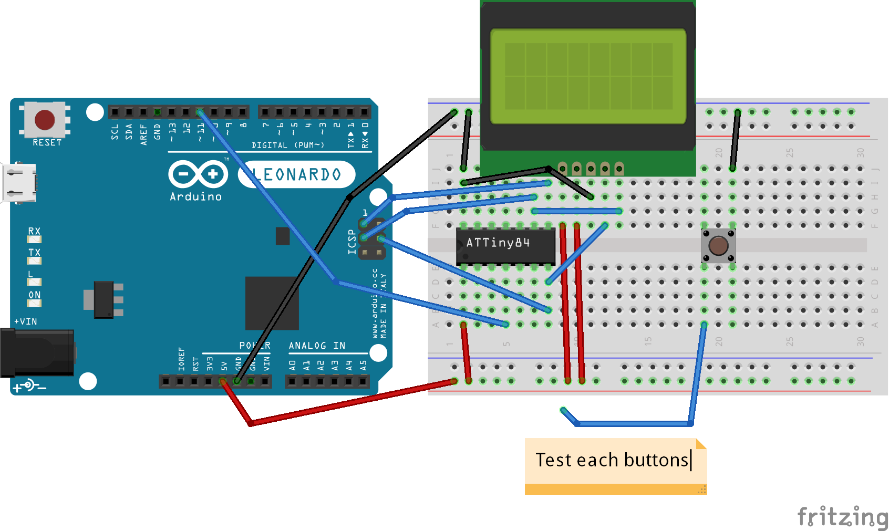
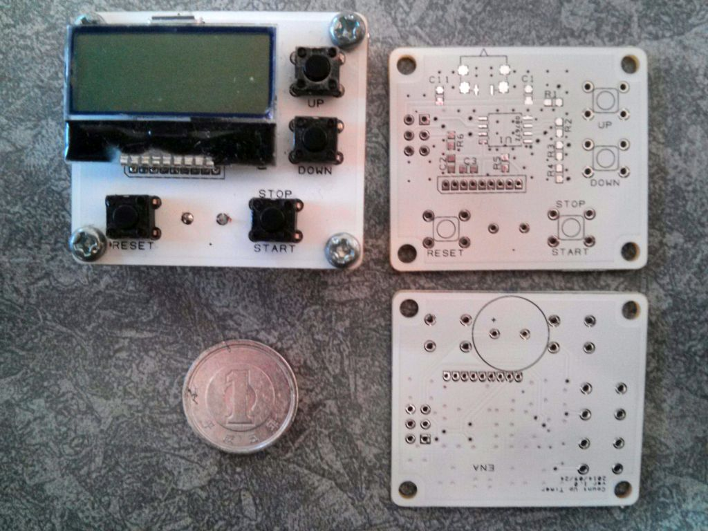

# Count Up Timer
* * *
# New Style Kitchen Timer
Conventional timers have simple display because they are based on **Count-Down** system.
They need to show only one time that is counted down.
But the simplification causes demerits:
* Must set time before starting the timer
 * Need time to prepare
 * Risk of forgetting (It causes time loss)
* Modifying time at halfway is not friendly
 * Be afraid of mistake
* Extension requires re-timer
 * Complicated

How to improve the user-fiendly?

***Use Count-Up!!***

iOS version is comming soon.

And to use it in the kitchen, I create the timer as hardware.
**Let's prototyping!**

# Prototyping
Preparation:
 * Arduino Leonardo
 * Arduino IDE 1.5.x and 1.0.4
 * arduino-tiny: [ATtiny core for Arduino](https://code.google.com/p/arduino-tiny/ "ATtiny core for Arduino")

## Breadboard
Arudino sketch: [uptimer_arduino](Arduino/sketch/uptimer_arduino "Arduino Sketch for Breadboard")

|Part Name | Quantity | Notes |
|----------|:--------:|-------|
|I2C 8x2 LCD | 1 | |
|pitch converter board | 1 | 1.5mm to 2.54mm pitch for LCD |
|Push button | 6 | tactile switch |
|Speaker | 1 | piezoelectric speaker |

## Universal Board
Arudino sketch: [uptimer_arduino](Arduino/sketch/uptimer_arduino "Arduino Sketch for Universal Board")
(the same scketch as Breadboard)

|Part Name | Quantity | Notes |
|----------|:--------:|-------|
|I2C 8x2 LCD | 1 | |
|pitch converter board | 1 | 1.5mm to 2.54mm pitch for LCD |
|Push button | 6 | tactile switch |
|Speaker | 1 | piezoelectric speaker |

## ATTiny84 Programming
Arudino sketch: [uptimer_attiny84](Arduino/sketch/uptimer_attiny84 "Arduino Sketch for ATTiny84")

|Part Name | Quantity | Notes |
|----------|:--------:|-------|
|I2C 8x2 LCD | 1 | |
|pitch converter board | 1 | 1.5mm to 2.54mm pitch for LCD |
|Push button | 1 | tactile switch |
|ATTiny84 | 1 | DIP |

## PCB Prototyping
### ~~Gen. 1~~
~~First prototype: 4.2mm x 3.7mm~~

It works fine, but I need to update.

### Gen. 2
 * Same layout as the mobile app
 * 4.2mm x 4.2mm

After function check, I'll upload schematic and layout data.

## License
 This work is licensed under a <a rel="license" href="http://creativecommons.org/licenses/by-nc-sa/4.0/">Creative Commons Attribution-NonCommercial-ShareAlike 4.0 International License</a>.
